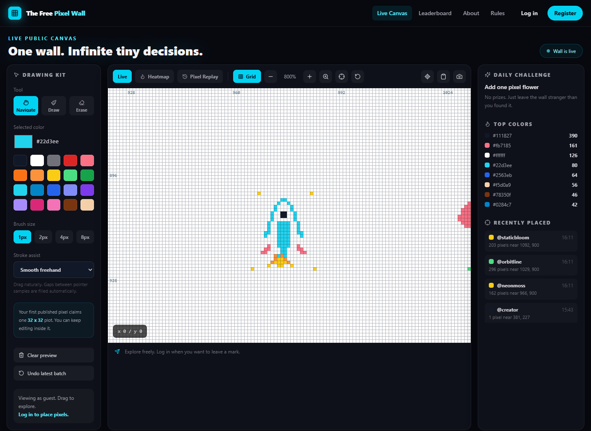
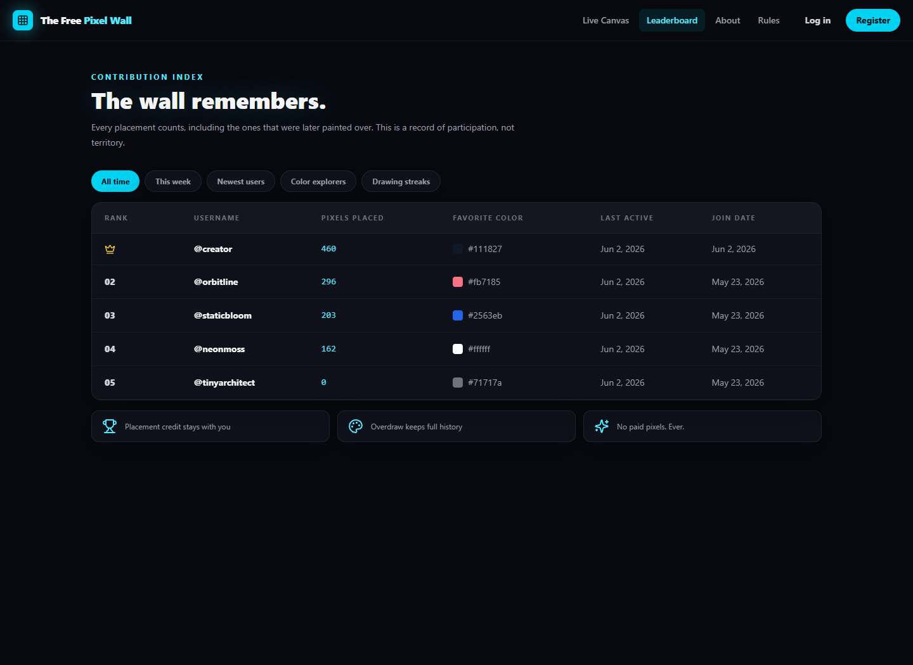
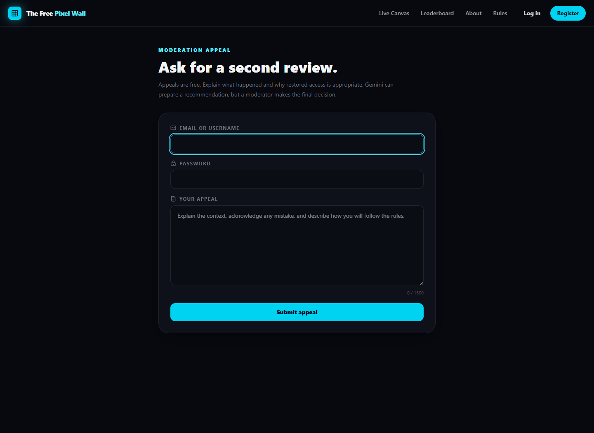

# The Free Pixel Wall

[](https://react.dev/)
[](https://vite.dev/)
[](https://www.typescriptlang.org/)
[](https://expressjs.com/)
[](https://socket.io/)
[](https://pixel-wall-frontend.vercel.app/)

A free, real-time collaborative pixel canvas. Visitors can explore the wall, while registered users can draw, keep contribution credit, view profiles, and climb the leaderboards. Pixel history is append-only: overdraw changes the visible wall without erasing its story.

**Live website:** [https://pixel-wall-frontend.vercel.app/](https://pixel-wall-frontend.vercel.app/)

## UI Screenshots

### Live canvas



### Leaderboard



### Moderation appeal



## Stack

- React, Vite, TypeScript, React Router, Tailwind CSS
- Node.js, Express, TypeScript, Socket.io
- SQLite through Node's built-in `node:sqlite` module
- bcrypt password hashing and hashed bearer session tokens
- Vercel Analytics page-view tracking and Speed Insights performance metrics

## Production deployment

The frontend and API are separate deployments. Vercel hosts the Vite frontend; Railway hosts the Express, Socket.io, and SQLite backend.

This repository includes Vercel configs for both supported project-root modes. Your existing Vercel project can keep **Root Directory** set to `frontend`; the frontend-local config installs dependencies, runs `npm run build:vercel`, publishes `dist`, and rewrites client-side React Router URLs to `index.html`. A root-level config is also available if you later switch **Root Directory** to the repository root (`.`).

If Vercel has dashboard overrides enabled, use these exact values:

```text
Install Command: npm install
Build Command: npm run build:vercel
Output Directory: dist
```

These values assume **Root Directory** is `frontend`. Do not use `npm run build backend && npm run build frontend`. Those trailing words become arguments to Vite, causing it to search for `backend/index.html` or `frontend/index.html`.

In Vercel, add these frontend environment variables and redeploy:

```text
VITE_API_URL=https://your-railway-public-domain
VITE_SOCKET_URL=https://your-railway-public-domain
```

The `VITE_` prefix is required: Vite exposes only prefixed variables to browser code. Do not add `/api` to the URL. Environment-variable changes take effect only after a new Vercel deployment.

In Railway, set:

```text
CLIENT_URL=http://localhost:5173,https://pixel-wall-frontend.vercel.app
DATABASE_PATH=/data/pixel-wall.db
TRUST_PROXY=true
```

Attach a persistent Railway volume at `/data` so accounts and artwork survive restarts. Keep the moderation and Gemini secrets configured in Railway rather than committing `backend/.env`.

After deploying Railway, verify:

```text
https://your-railway-public-domain/api/health
```

It should return:

```json
{ "ok": true, "service": "pixel-wall-api" }
```


## Features

- 8192 x 8192 pan-and-zoom canvas with a zoom-aware pixel grid, expanded color palette, eraser, and 1px, 2px, 4px, and 8px brushes
- One bounded 32 x 32 artwork entry per account, claimed by the first published batch
- Real-time placement and undo broadcasts through Socket.io
- Preview clearing, screenshot export, random-area jumps, and shareable location links
- Heatmap overlay, color stats, recent placements, and pixel replay
- All-time, weekly, newest-user, unique-color, and drawing-streak leaderboards
- User profiles with contribution metrics, recent activity, and a mini artwork preview
- Per-user cooldowns, request rate limiting, coordinate and color validation, flood limits, and stricter limits for new accounts
- Layered artwork moderation with classifier hooks, review queues, session revocation, privacy-preserving blacklists, network bans, and offending-plot cleanup

## Canvas Interaction System

The wall is an `8192 x 8192` logical pixel world rendered through a viewport-sized HTML canvas. This keeps navigation responsive without asking the browser to move or repaint the full world bitmap.

- `Navigate` mode is the default. Drag to pan and use the mouse wheel or trackpad to zoom toward the cursor.
- `Draw` and `Erase` are toggles. Clicking an active tool again returns immediately to `Navigate`.
- The toolbar includes zoom in, zoom out, reset zoom, center canvas, reset view, coordinates, brush sizes, and color controls.


Network bans can affect people sharing an address, so review the queue and keep an appeal path when operating the wall publicly. The protected restore endpoint clears the account ban and its blacklist fingerprints after a successful appeal. Removed artwork stays erased, active sessions stay revoked, and the restored user must sign in again.

## Moderation appeals

Restricted users can open `/appeal`, verify the banned account with its username or email and password, and submit a 30-1500 character appeal statement. This route is deliberately available from blocked networks, but it is narrowly scoped, password protected, receipt scoped, and limited to five attempts per hour.

Set `GEMINI_API_KEY` in the ignored `backend/.env` file to enable Gemini recommendations. The backend calls `gemini-2.5-flash` by default with structured JSON output and asks for one of `restore`, `deny`, or `human_review`. Gemini does not directly restore accounts. Its recommendation, confidence, and rationale are added to the protected moderator queue; a moderator makes the final decision.

Public appeal routes:

```text
POST /api/appeals
GET  /api/appeals/:id
```

Additional moderator routes:

```text
GET  /api/moderation/appeals
POST /api/moderation/appeals/:id/restore
POST /api/moderation/appeals/:id/deny
```

## Responsive navigation

Desktop screens show the full global navbar. Tablet and mobile screens use an animated three-line hamburger menu. The menu closes when a route is selected, when the user clicks outside it, or when Escape is pressed. Page scrolling is locked only while the mobile menu is open.

## Known limitations

- SQLite is intended for local development. A production deployment should move to PostgreSQL.
- Screenshot export creates a full-wall PNG and can take a moment on lower-memory devices.
- Each account owns one `32 x 32` editable plot.

## Future ideas

- PostgreSQL migration and production hosting
- Plot minimap navigation
- Moderator dashboard, appeals workflow, and classifier-provider deployment
- Email verification and password reset

## API

Required routes:

```text
POST /api/auth/register
POST /api/auth/login
GET  /api/auth/me
POST /api/auth/logout
GET  /api/canvas
POST /api/canvas/pixels
GET  /api/leaderboard/all-time
GET  /api/leaderboard/weekly
GET  /api/leaderboard/newest
GET  /api/users/:id/profile
GET  /api/users/:id/activity
```

Feature routes:

```text
POST /api/canvas/undo
GET  /api/leaderboard/colors
GET  /api/leaderboard/streaks
GET  /api/stats/colors
GET  /api/stats/heatmap
GET  /api/replay
GET  /api/moderation/monitor
GET  /api/moderation/events/:id/plot
POST /api/moderation/events/:id/ban
POST /api/moderation/events/:id/allow
POST /api/moderation/users/:id/restore
POST /api/appeals
GET  /api/appeals/:id
GET  /api/moderation/appeals
POST /api/moderation/appeals/:id/restore
POST /api/moderation/appeals/:id/deny
```

## Moving toward PostgreSQL

The schema uses conventional relational tables and the client only talks to HTTP APIs. To migrate, replace the small synchronous SQLite access layer in `backend/src/db.ts` and the SQL calls in `backend/src/index.ts` with a PostgreSQL adapter or query builder. The API contract and frontend do not need to change.
